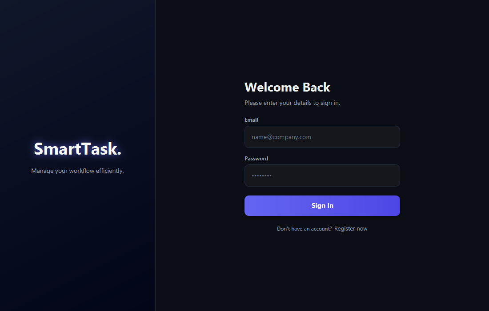
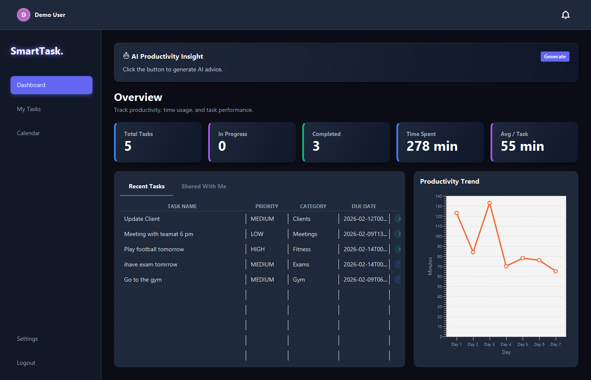
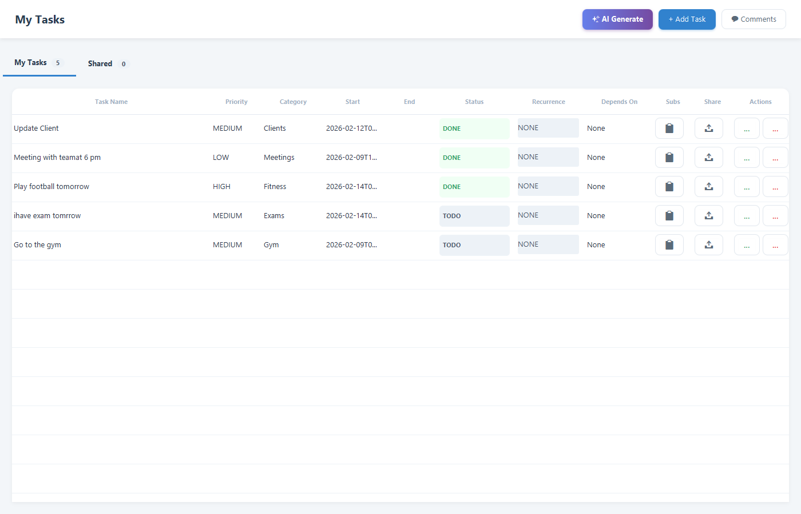
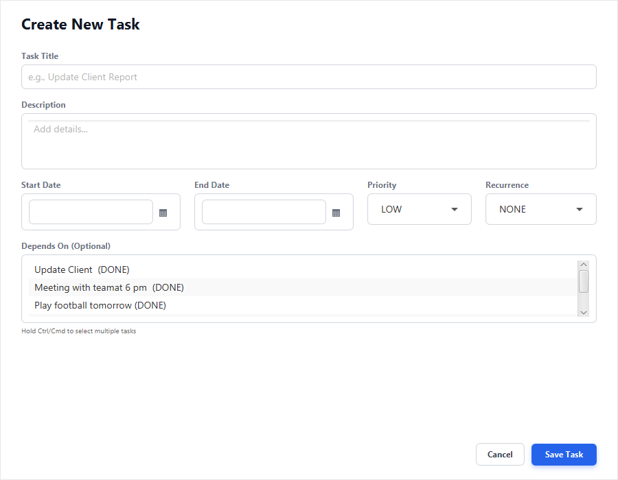
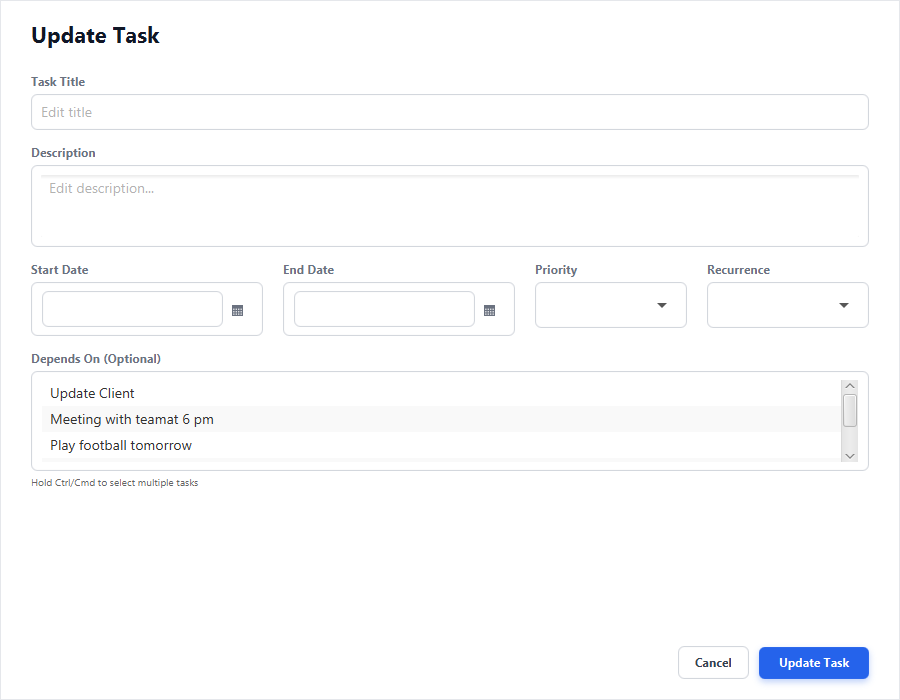
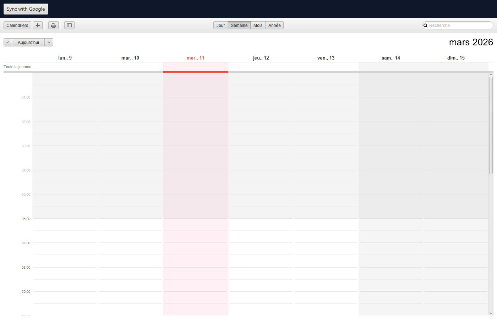
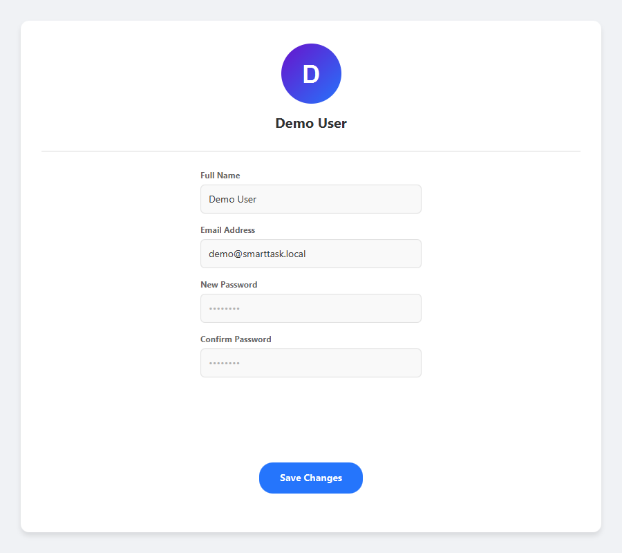
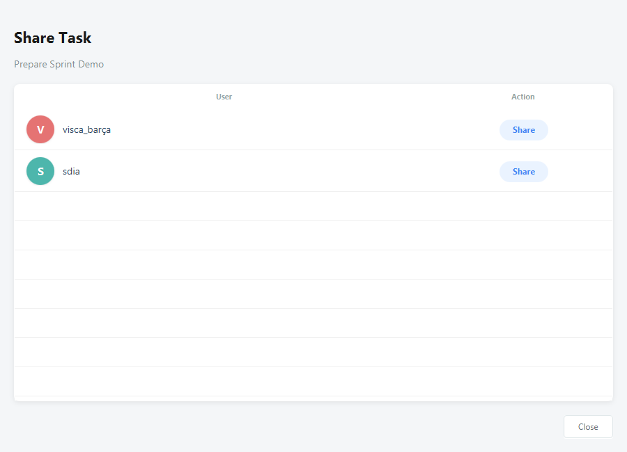
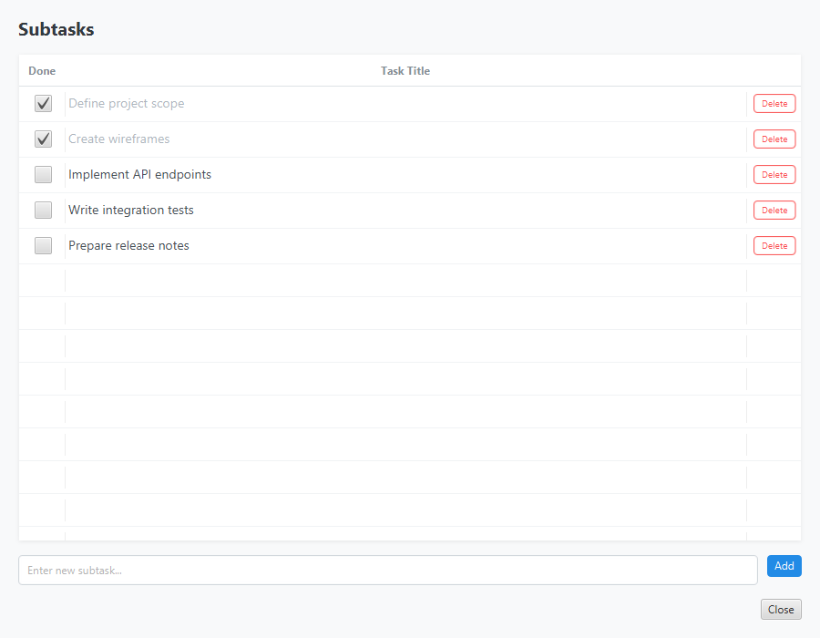

# SmartTask-F

SmartTask-F is a desktop task management app with a Java Servlet backend and a JavaFX frontend.
It focuses on planning, collaboration, and scheduling with optional AI and Google Calendar integrations.

## Tech Stack

- Backend: Java 17, Jakarta Servlet, JDBC, MySQL, WebSocket
- Frontend: JavaFX (FXML + CSS), CalendarFX, Java HTTP client
- Optional integrations: AI service (`localhost:9090`), Gmail SMTP, Google Calendar API

## Core Features

- User registration/login with email verification
- Task CRUD with priority, status, dates, dependencies, and recurrence
- Shared tasks between users
- Subtasks management
- Realtime comments and notifications (WebSocket)
- File attachments in comments
- Calendar planning with drag/resize updates
- Google Calendar sync
- AI task parsing, category suggestion, and productivity insights

## Quick Start

1. Start MySQL and create a database named `db_tasks`.
2. Configure database connection in `src/main/java/util/DBConnection.java`.
3. (Optional) Set mail environment variables for verification emails:
   - `MAIL_USER`
   - `MAIL_PASS`
4. Build backend WAR:

```powershell
mvn clean package
```

5. Deploy the generated WAR in `target/` to Tomcat 10+.
6. Set frontend backend URL in `frontend-fro/src/main/resources/application.properties`:

```properties
backend.base-url=http://localhost:8080/
```

7. Run frontend:

```powershell
cd frontend-fro
.\mvnw.cmd javafx:run
```

## Optional Services

- AI service endpoints expected on `http://localhost:9090`.
- Add `credentials.json` to `frontend-fro/src/main/resources/` for Google Calendar sync.

## Screenshots

### Login


### Dashboard


### My Tasks


### Create Task


### Update Task


### Calendar


### Settings


### Share Task


### Subtasks


## Project Structure

```text
Smart-Task-F/
  src/main/java/        # Backend
  frontend-fro/         # JavaFX frontend
  docs/screenshots/     # README images
```

## Note

This project is good for learning/demo use. For production use, add stronger security practices (for example password hashing and stricter API auth).
# Smart-Task
